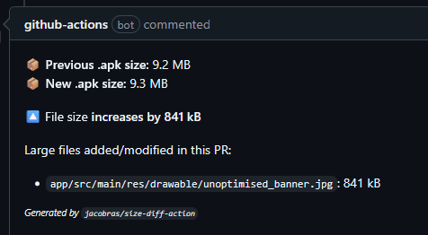

# Size Diff Action

GitHub Action to track a file's size difference, compared to a main branch. For example, to track an Android
app's debug APK size on pull requests:



## Usage

Add `jacobras/size-diff-action@v1` with these parameters:

* `path` the file to track the size of (can be a glob pattern)
* `mainBranchName` the name of your main branch (optional, defaults to "main")

The output is a summary that can be posted as a comment to PRs. For example, to track an Android app's debug APK size:

```yml
- name: Calculate APK size difference
  id: size-diff
  uses: jacobras/size-diff-action@v1
  with:
    path: app/build/outputs/apk/debug/app-debug.apk # or any other file, as long as it exists

- name: Comment APK size difference
  uses: marocchino/sticky-pull-request-comment@v2
  with:
    header: size-diff
    message: ${{ steps.size-diff.outputs.summary }}
```

_Specify the `mainBranchName` parameter if your main branch is not called "main."_

> [!IMPORTANT]
> Make sure to add the `pull-requests: write` permission for the comment poster.
> See https://github.com/marocchino/sticky-pull-request-comment for more details.

<details>
<summary>Example: tracking a Kotlin/JS library's production JS size</summary>

```yml
- name: Build production JS file for size comparison
  run: ./gradlew compileProductionExecutableKotlinJs

- name: Calculate JS size difference
  id: size-diff
  uses: jacobras/size-diff-action@v1
  with:
    path: build/js/packages/composeApp/kotlin/Human-Readable.js
    mainBranchName: main # only needed if not "main"

- name: Comment JS size difference
  uses: marocchino/sticky-pull-request-comment@v2
  with:
    header: size-diff
    message: ${{ steps.size-diff.outputs.summary }}
```

</details>

## Limitations/known issues

1. Tracks only one file.
2. File size is stored in GH Action's cache. If it's not used for 7 days, it gets deleted, so the main branch will have
   to run again to write the main (golden) file size.
3. Because this uses GH Action's cache internally, it only works for branches that are branched off the main branch
   where the file size has been cached.
4. Doesn't work on Windows runners. Temporary file with size gets created, but `saveCache()` can't find it for whatever
   reason (help welcome). Workaround: upload your file in an artifact, then in a job running on ubuntu-latest, download
   it and run the size diff action.

## Q & A

#### Why does the comment show "Previous size: -1 byte"?

That happens when the action hasn't been run on the main/develop branch yet. Make sure to check the `mainBranchName`
parameter. It could also mean the cache was deleted, which happens by GitHub when an entry hasn't been touched for 7
days.

#### Does this commit the file size on every change?

No, the file size is stored in GitHub Action's cache, so no continuous commits are needed/done.

## Contributing

### Publishing the Action

The project is mostly Kotlin, with just the main entrypoint written in JS.

1. Build JS from Kotlin module using `gradlew kotlinUpgradeYarnLock :action-logic:jsNodeProductionRun`
2. Build full JS dist using `rollup --config rollup.config.js`
3. Push /dist.